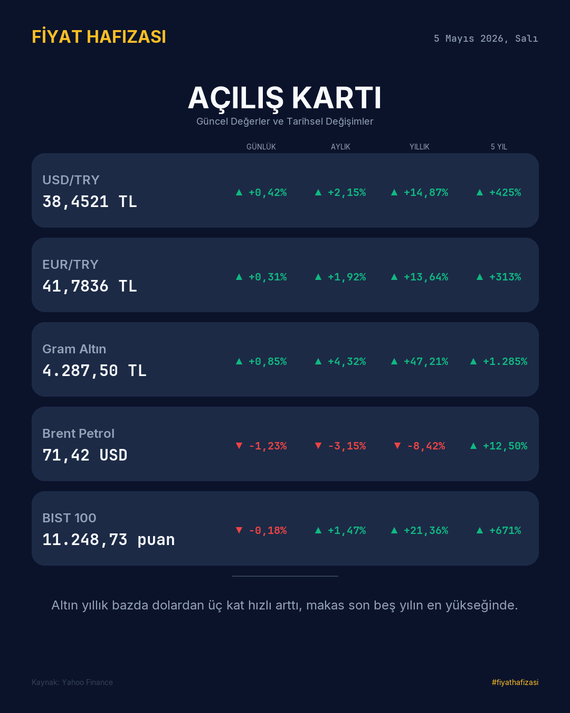
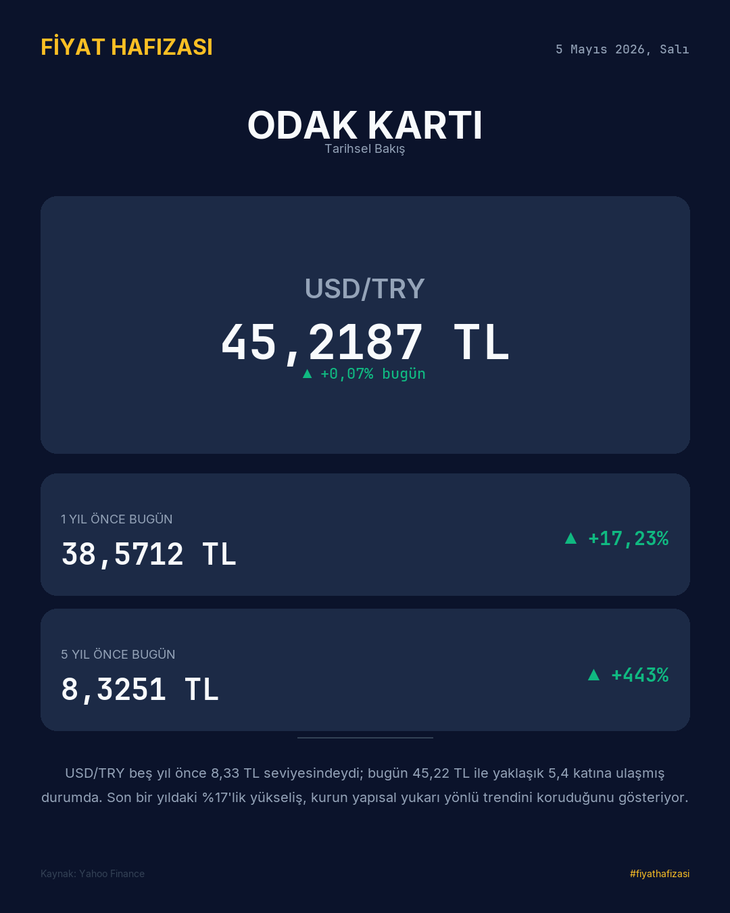
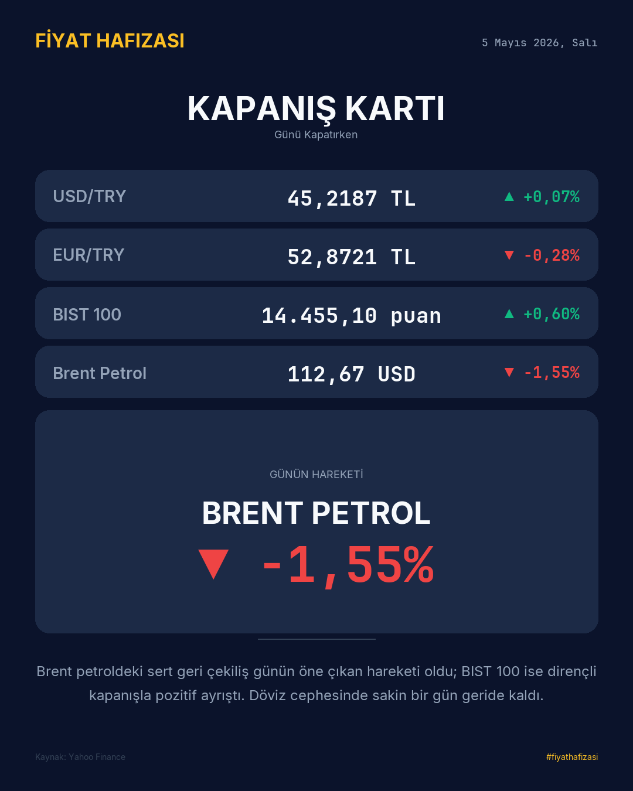
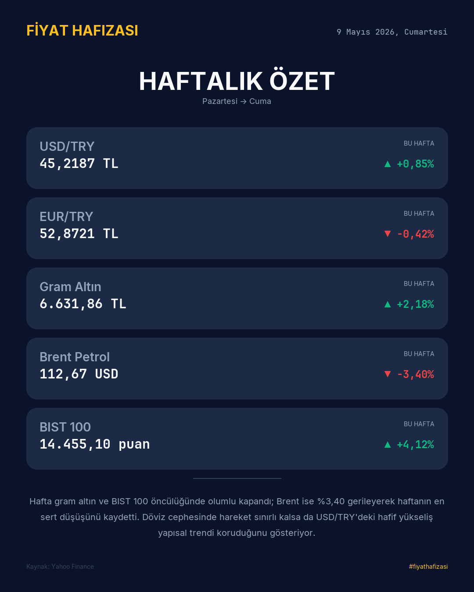
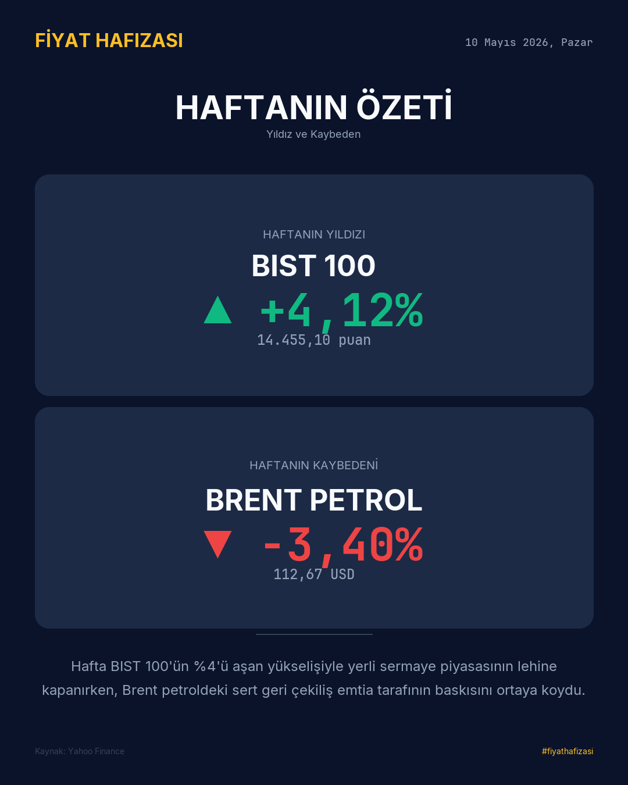

# <p align="center">📊 Ekonomikartı: Fiyat Hafızası</p>

<p align="center">
  
  
  
  
</p>

<p align="center">
  <b>Finansal verileri sanat eserine dönüştüren, tam otomatik piyasa takip ve görselleştirme motoru.</b><br>
  <i>TCMB ve Yahoo Finance verileriyle beslenen, Gemini ile yorumlanan, her gün cebinize gelen şıklık.</i>
</p>

---

## 🌟 Vizyon

Ekonomikartı, karmaşık finansal verileri "gürültüden" arındırır. Sadece sayıları değil, o sayıların **tarihsel hafızasını** modern bir tasarım diliyle sunar. Her sabah, öğle ve akşam, sosyal medya paylaşımına hazır, premium estetiğe sahip bilgi kartları üretir.

## 🎨 Tasarım Dili: "Premium Dark"

Proje, minimalizm ve yüksek kontrast prensipleri üzerine inşa edilmiştir.

### 🎨 Renk Paleti (UI/UX)
| Renk | HEX | Görev |
| :--- | :--- | :--- |
| **Arka Plan** | `#0B132B` | Derinlik ve odak sağlayan ana zemin. |
| **Yüzey** | `#1C2A46` | Verileri havada tutan modern widget katmanı. |
| **Vurgu** | `#FBBF24` | Dikkat çekilmesi gereken marka ve başlık unsurları. |
| **Pozitif** | `#10B981` | Piyasa yükselişlerini simgeleyen canlı zümrüt. |
| **Negatif** | `#EF4444` | Piyasa düşüşlerini simgeleyen uyarıcı kırmızı. |

### 🔡 Tipografi Hizalaması
- **Sans-Serif Gücü:** Başlıklarda ve marka isminde `Inter Bold` ile modern bir duruş.
- **Monospace Keskinliği:** Fiyatlarda ve yüzdeliklerde `JetBrains Mono` ile matematiksel netlik.

---

## 🛠️ Teknik Mimari

Ekonomikartı'nın kalbinde, verinin ham halden görsel bir karta dönüşmesini sağlayan 4 aşamalı bir **Pipeline** bulunur:

1.  **Ingestion:** `yfinance` ve `TCMB EVDS` API'leri üzerinden canlı verilerin eş zamanlı çekilmesi.
2.  **Processing:** Çekilen verilerin 1 yıllık, 5 yıllık ve günlük değişimlerinin matematiksel analizi.
3.  **Intelligence:** `OpenRouter/Gemini` entegrasyonu ile o günün piyasa hareketlerine dair "insansı" bir yorum üretilmesi.
4.  **Rendering:** `Pillow` motoru ile Anti-Aliasing destekli, 1080x1350 (Instagram optimize) çözünürlükte PNG üretimi.

---

## 📂 Dosya Sistemi Rehberi

```bash
Ekonomikarti/
├── 🤖 .github/workflows/    # 7/24 çalışan otomasyon (Cron Jobs)
├── 🖋️ assets/fonts/         # Lisanslı tipografi dosyaları
├── 💾 data/
│   ├── manual/             # Harici veri girişleri (Akaryakıt vb.)
│   └── output/             # Veri bankası (JSON formatında tarihsel loglar)
├── 🖼️ output/
│   ├── live/               # Sosyal medya için "Sıcak" çıktılar
│   └── test/               # Geliştirici önizleme klasörü
├── 🧠 src/
│   ├── data/               # Finansal konektörler (TCMB, Yahoo)
│   ├── render/             # Görsel motor (Her kart için ayrı şablon)
│   ├── caption/            # Yapay zeka yorumlayıcı
│   └── config.py           # Sistemin genetik kodları (Renk, Geometri, Gösterge)
└── 🚀 run_*.py             # Zamanlanmış tetikleyiciler
```

---

## 🍱 Kart Çeşitleri & Galeri

Her kart, günün farklı saatlerine ve veri türlerine göre özel olarak tasarlanmıştır.

### 🌅 Açılış Kartı (Morning Card)
Güne başlarken piyasadaki en kritik 5 göstergeyi, 4 farklı tarihsel penceredeki (Günlük, Aylık, Yıllık, 5 Yıl) değişim yüzdeleriyle birlikte sunar.
<p align="center">
  
</p>

### 🎯 Odak Kartı (Noon Focus Card)
Günün rotasyonuna göre (Pzt: USD, Sal: EUR vb.) tek bir göstergeye odaklanır ve onun tarihsel fiyat hafızasını (1 yıl ve 5 yıl önce bugün) detaylandırır.
<p align="center">
  
</p>

### 🌇 Kapanış Kartı (Evening Card)
Günün kapanış rakamlarını ve günün "en sert hareketini" (Yıldızını veya Kaybedenini) tek bir karede özetler.
<p align="center">
  
</p>

### 📅 Haftalık Özet & Haftanın Yıldızı
Hafta sonları (Cumartesi-Pazar) üretilen bu kartlar, haftalık trendleri mini grafikler (sparklines) ve haftalık performans liderleriyle sunar.
<p align="center">
  
  
</p>

---

## ⚙️ Kurulum ve Kullanım

Sistemi yerelinizde ayağa kaldırmak sadece 3 dakika sürer.

```bash
# 1. Depoyu klonlayın
git clone https://github.com/fatihdisci/Ekonomikarti.git

# 2. Bağımlılıkları yükleyin
pip install -r requirements.txt

# 3. Fontları otomatik indirin
python scripts/download_fonts.py

# 4. İlk kartınızı üretin
python run_morning.py
```

---

## 🛡️ Lisans ve Katkı

Bu proje **MIT** lisansı ile korunmaktadır. Fikirlerinize ve Pull Request'lerinize her zaman açığız.

<p align="center">
  <i>Fiyat Hafızası ile ekonomiyi sadece takip etmeyin, onu görün.</i><br>
  <b>#fiyathafizasi</b>
</p>
